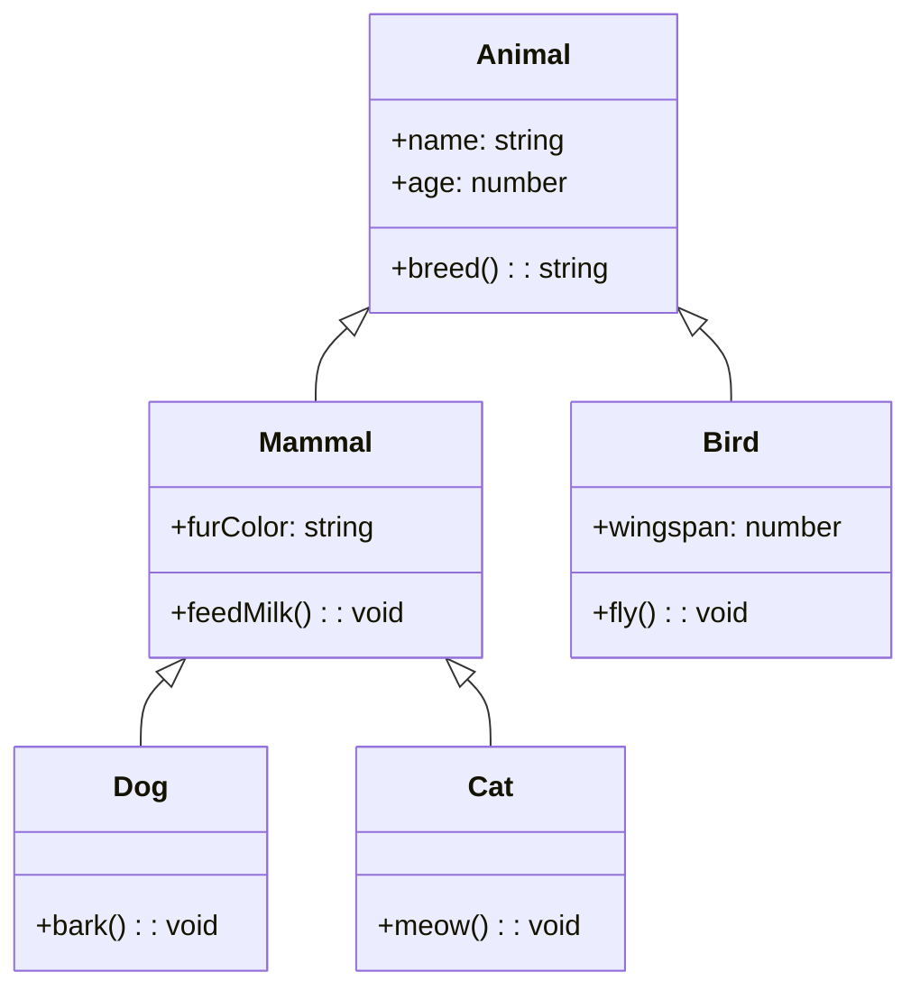

## Inleiding

Met Inheritance kunnen we een nieuwe klasse maken die gedrag hergebruikt en uitbreidt van een andere class, een basisclass genaamd, en de nieuw gemaakte class wordt de afgeleide class genoemd. 

Inheritance is het baseren van een Class op een andere Class. De naam die we daarvoor gebruiken is overerven. 
Hierdoor hoef je properties en functionaliteit van de base class niet opnieuw te definiëren en kan je de derived class die gebruiken voor extra properties en functionaliteit. 
Inheritance wordt vooral gebruikt voor technische onderdelen en niet domein onderdelen. 

De derived class kan geen gebruik maken van de private properties en functionaliteit.
Als je dit wel wil gebruik dan protected.

Een class kan maar van 1 Base class derived zijn. 

```c#
 public class Animal
    {
        public Double Weight;

        public Animal(double weight)
        {
            Weight = weight;
        }

        public void Eat(double food)
        {
           Weight += food;
        }
    }

    public class Bird : Animal
    {
        public Bird(double weight) : base(weight)
        {
        }
    }


[TestClass]
    public class BirdTest
    {
        [TestMethod]
        public void Bird_Has_Initial_Weight()
        {
            Animal bird = new Bird(0.2);
            Assert.IsTrue(bird.Weight == 0.2);
        }

        [TestMethod]
        public void Eat_BirdWithWeight02_GainsWeight()
        {
            double weigth = 0.2;
            Bird bird = new(weigth);
            bird.Eat(0.6);

            Assert.IsTrue(bird.Weight == 0.8);

        }
    }

```
Om basis functionaliteit te overschrijven van de methodes uit de basis-Class is het de gewoonte om in de basis de Method virtual te maken:

```c#
	public class Animal
    {
        public virtual string MakeNoise()
        {
            return "snffff";
        }
        public string Soort()
        {
            return "Animal";
        }
    }
    public class Bird : Animal
    {    
        public override string MakeNoise()
        {
            return "Tjilp";
        }
        public string Soort()
        {
            return "Bird";
        }
    }
```




### Meer info:
[Inheritance](https://learn.microsoft.com/en-us/dotnet/csharp/fundamentals/object-oriented/inheritance)