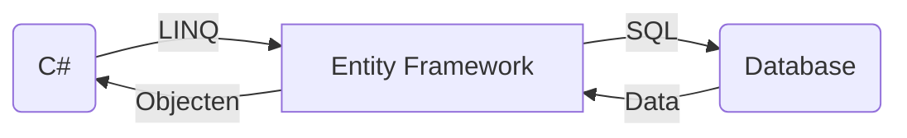

Is een library van Microsoft en die is bedoeld als abstractie laag zodat je als developer eigenlijk niet veel kennis nodig hebt van SQL zelf. 

Vanuit C# kan je LINQ gebruiken om via de EF data uit een SQL database te halen. EF vertaald LINQ naar SQL query's en vertaald het resultaat weer terug naar een C# object:


https://mermaid.live/

Het is vergelijkbaar met de ORM Framework uit JAVA. Omdat JAVA hier veel eerder mee was, moest Microssoft om klanten te behouden ook een eigen versie van hebben.

C# gebruikt LINQ statements om aan de DBContext aan te geven welke data er opgehaald moet worden. De provider in de DBContext bepaald wat voor een query er gemaakt moet worden en voert deze uit op de database. Er bestaan voor bijna alle populaire Databases een provider bijv.:

- MSSQL
- MySQL
- MongoDB

Deze providers leveren de data aan als C# Object. Meestal vraag je data als Class op. De relatie zou je kunnen zien als de naam van de class is de naam van de tabel en de namen van de verschillende kollommen zijn de namen van de properties.

Hier moet er dus wel rekening gehouden worden van de Relationele wereld van SQL en de Object Georienteerde wereld van C#.

De nuget libs die we gebruiken is Microsoft.EntityFrameworkCore, Microsoft.EntityFrameworkCore.Design, Microsoft.EntityFrameworkCore.SqlServer

```xml
  <ItemGroup>
    <PackageReference Include="Microsoft.EntityFrameworkCore" Version="7.0.5" />
    <PackageReference Include="Microsoft.EntityFrameworkCore.Design" Version="7.0.5">
      <PrivateAssets>all</PrivateAssets>
      <IncludeAssets>runtime; build; native; contentfiles; analyzers; buildtransitive</IncludeAssets>
    </PackageReference>
    <PackageReference Include="Microsoft.EntityFrameworkCore.SqlServer" Version="7.0.5" />
  </ItemGroup>
```


BBOM

### Meer info:

[Getting Started with EF Core](https://learn.microsoft.com/en-us/ef/core/get-started/overview/first-app?tabs=netcore-cli)