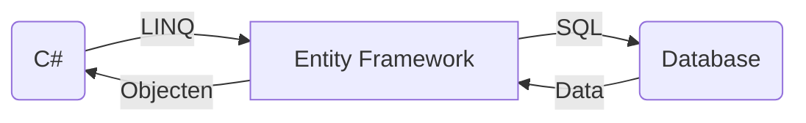

Is een library van Microsoft en die is bedoeld als abstractie laag zodat je als developer eigenlijk niet veel kennis nodig hebt van SQL zelf. 

Vanuit C# kan je LINQ gebruiken om via de EF data uit een SQL database te halen. EF vertaald LINQ naar SQL query's en vertaald het resultaat weer terug naar een C# object:

## DB First

Database bestaat al, inclusief tabellen, data, enz. 
Op basis hiervan kan je C# datamodel laten genereren die je kan gebruiken om data uit de database te halen en te muteren.

## Code First

Applicatie maken inclusief datamodel.
Entity Framework kan hiermee een database generenen inclusief tabellen 
Dit is de prefered way.
Dit omdat het ook Test-Driven gedaan kan worden. 
Kan alleen als er nog geen bestaande database is.