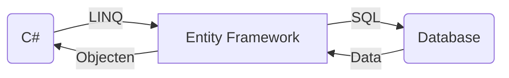

Entity Framework is een framework ontwikkeld door Microsoft dat gebruikt wordt om te communiceren met relationele databases. Het stelt ontwikkelaars in staat om te werken met databases als objecten in plaats van directe SQL queries te schrijven. Dit maakt het eenvoudiger om te werken met databases en vereenvoudigt het proces van het ophalen en opslaan van gegevens in een database.

Entity Framework creëert een abstractielaag tussen de applicatie en de database, wat betekent dat ontwikkelaars niet langer directe SQL queries hoeven te schrijven om gegevens op te halen en op te slaan. In plaats daarvan kunnen ontwikkelaars queries schrijven in C# en Entity Framework zal deze vertalen naar SQL en uitvoeren op de database.


https://mermaid.live/

Het is vergelijkbaar met de ORM Framework uit JAVA. Omdat JAVA hier veel eerder mee was, moest Microssoft om klanten te behouden ook een eigen versie van hebben.

C# gebruikt LINQ statements om aan de DBContext aan te geven welke data er opgehaald moet worden. De provider in de DBContext bepaald wat voor een query er gemaakt moet worden en voert deze uit op de database. Er bestaan voor bijna alle populaire Databases een provider bijv.:

- MSSQL
- MySQL
- MongoDB

Deze providers leveren de data aan als C# Object. Meestal vraag je data als Class op. De relatie zou je kunnen zien als de naam van de class is de naam van de tabel en de namen van de verschillende kollommen zijn de namen van de properties.

Hier moet er dus wel rekening gehouden worden van de Relationele wereld van SQL en de Object Georienteerde wereld van C#.

De nuget libs die we gebruiken is Microsoft.EntityFrameworkCore, Microsoft.EntityFrameworkCore.Design, Microsoft.EntityFrameworkCore.SqlServer

```xml
  <ItemGroup>
    <PackageReference Include="Microsoft.EntityFrameworkCore" Version="7.0.5" />
    <PackageReference Include="Microsoft.EntityFrameworkCore.Design" Version="7.0.5">
      <PrivateAssets>all</PrivateAssets>
      <IncludeAssets>runtime; build; native; contentfiles; analyzers; buildtransitive</IncludeAssets>
    </PackageReference>
    <PackageReference Include="Microsoft.EntityFrameworkCore.SqlServer" Version="7.0.5" />
  </ItemGroup>
```


**Wat zijn de voordelen van Entity Framework?** 
- Entity Framework vereenvoudigt het werken met databases door abstractie te bieden van de onderliggende database-engine.
- Het minimaliseert de hoeveelheid code die nodig is om te communiceren met een database, waardoor ontwikkelaars sneller en efficiënter kunnen werken.
- Entity Framework is ook handig voor het maken van testgegevens voor een applicatie, omdat het mogelijk is om gegevens te genereren vanuit de objecten in plaats van rechtstreeks in de database te werken.
- Het ondersteunt verschillende database-engines, waaronder SQL Server, MySQL, Oracle en PostgreSQL.


### Meer info:

[Getting Started with EF Core](https://learn.microsoft.com/en-us/ef/core/get-started/overview/first-app?tabs=netcore-cli)