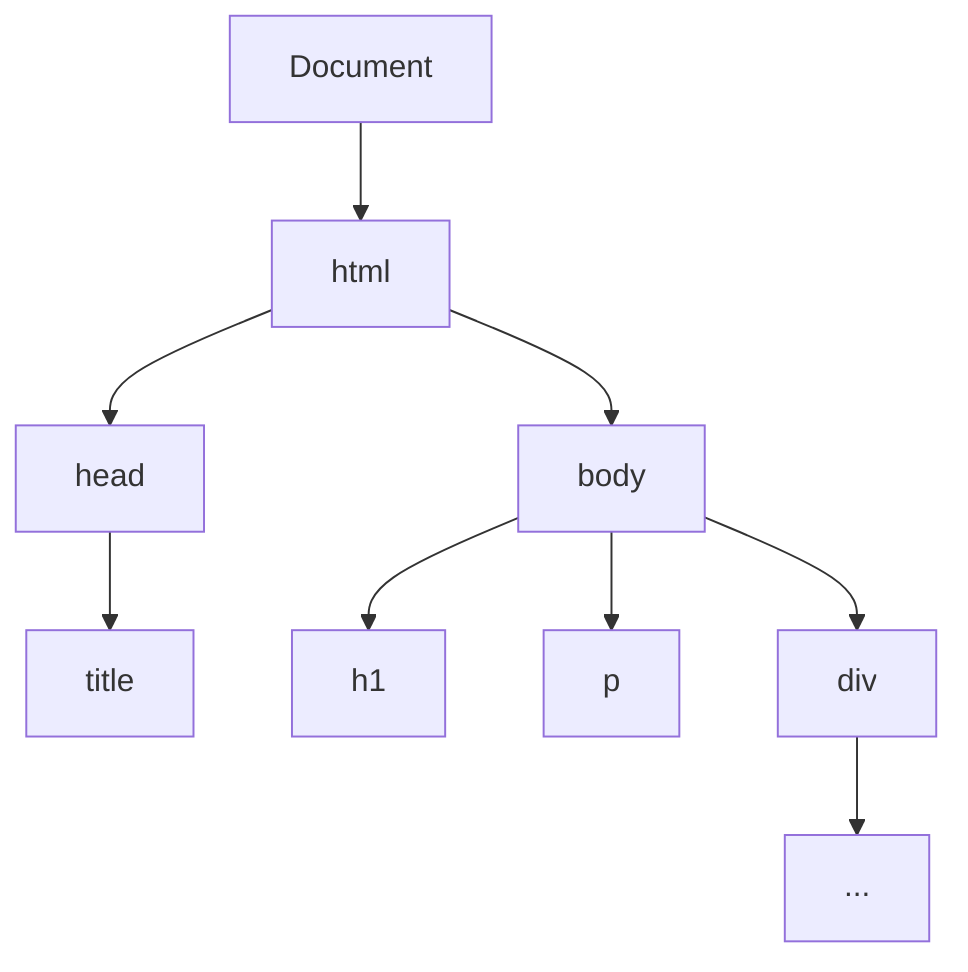

De Document Object Model (DOM) is in feite een boomstructuur die wordt gemaakt door de webbrowser. Elke keer als je een webpagina opent, maakt de browser een model van die pagina in de vorm van een boomdiagram. Dit is de DOM.

Stel je voor dat je een gezin hebt. Je hebt grootouders aan de top, die kinderen hebben, en die kinderen hebben op hun beurt weer eigen kinderen. Dit is vergelijkbaar met hoe de DOM werkt.

In de DOM zijn de grootouders het documentobject. Dit documentobject heeft kinderen, zoals het html-element. Het html-element heeft ook kinderen, namelijk het head-element en het body-element. Deze elementen kunnen op hun beurt ook kinderen hebben, zoals het title-element in de head en verschillende elementen in de body, zoals h1, p, div, enz..

Met de DOM kunnen ontwikkelaars het volgende doen:
- Elementen selecteren en wijzigen op basis van hun ID, klasse, tag of andere attributen.
- Elementen maken, verwijderen of verplaatsen op de webpagina.
- Inhoud van elementen wijzigen, zoals tekst, HTML, attributen, stijlen en meer.
- Interactie toevoegen aan de webpagina door het vastleggen en reageren op gebeurtenissen, zoals klikken, scrollen, formulierinzendingen, enz.
- Dynamisch nieuwe elementen en inhoud toevoegen aan de webpagina.
- De structuur en stijl van de webpagina aanpassen op basis van gebruikersinteracties of andere voorwaarden.

Kortom, de DOM fungeert als een interface tussen webpagina's en JavaScript-code, waardoor ontwikkelaars de mogelijkheid hebben om webpagina's te manipuleren en interactieve en dynamische ervaringen te creëren.

