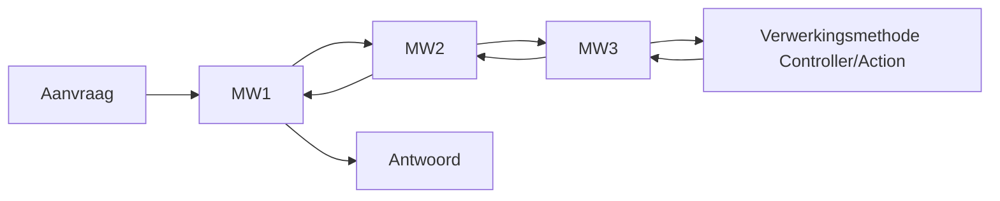

Middleware in ASP.NET Core is een manier om HTTP-requests en -responses te verwerken. Ze worden gebruikt voor een verscheidenheid aan taken, zoals authenticatie, routing, enz. De naam "middleware" komt van het feit dat ze in het midden van de request-response pipeline zitten. Een request passeert meerdere middleware (meestal in een keten) voordat het een response genereert.

Elke middleware heeft toegang tot het HttpContext-object en kan beslissen om het request door te geven aan de volgende middleware in de pipeline (door `next()` aan te roepen) of om de pipeline onmiddellijk te beëindigen en een response te genereren.

Je kunt je eigen middleware maken door een klasse te schrijven met een methode genaamd `Invoke` of `InvokeAsync`. Deze methode neemt een HttpContext en een functiedelegate voor de volgende middleware in de pipeline.

Hier is een eenvoudig voorbeeld van een middleware die alle 404 responses logt:

```csharp
using Microsoft.AspNetCore.Http.Extensions;
using Serilog;

namespace DemoProject.Middleware
{
    public class PageNotFoundLogger : IMiddleware
    {
        public async Task InvokeAsync(HttpContext context, RequestDelegate next)
        {
            try
            {
                await next(context);

                if (context.Response.StatusCode == 404)
                {
                    Log.Error($"{context.Request.GetDisplayUrl()} resulteert in {context.Response.StatusCode}");
                }
            }
            catch (Exception ex)
            {
                Log.Error(ex.Message);
            }
        }
    }

    public static class PageNotFoundLoggerExtensions
    {
        public static IApplicationBuilder UsePageNotFoundLogger(this IApplicationBuilder app)
        {
            return app.UseMiddleware<PageNotFoundLogger>();
        }
    }
}
```

In deze code, wanneer `InvokeAsync` wordt aangeroepen, gaat het request eerst door naar de volgende middleware in de pipeline (aangezien we `await _next(context);` aanroepen). Daarna controleren we de statuscode van de response. Als de statuscode 404 is, loggen we een waarschuwing.

Om deze middleware te gebruiken, moet je deze toevoegen aan de pipeline in de `Main` methode in je `Program` klasse, zoals dit:

```csharp
app.UsePageNotFoundLogger();
```

Zorg ervoor dat je de middleware toevoegt in de juiste volgorde. Middleware wordt in volgorde uitgevoerd zoals ze zijn toegevoegd in de `Main` methode. In dit geval wil je waarschijnlijk de UsePageNotFoundLogger vroeg in de pipeline toevoegen, zodat het alle responses kan vangen.


Hier is een eenvoudig diagram dat de flow van aanvragen en antwoorden door een reeks middlewarecomponenten illustreert:


