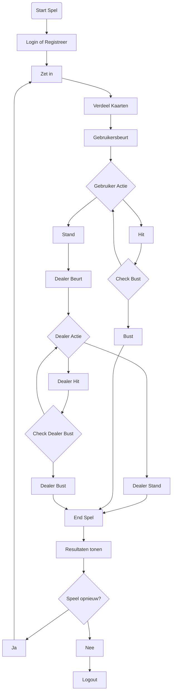

Story mapping is een visuele oefening die teams helpt om te bepalen hoe software functies in de loop van de tijd zullen worden ontwikkeld. Het is een techniek die gebruikt wordt in Agile en Lean software ontwikkelingsmethodologieën, vooral in Scrum en Kanban.

## Wat is Story Mapping?

Een story map is een visueel model van de reis van een gebruiker door een product, die helpt om het grotere plaatje van het werk te zien. Het helpt om functies en werkzaamheden in context te plaatsen en te begrijpen hoe ze passen in de totale gebruikerservaring.

## Hoe maak je een Story Map?

1. **Identificeer je gebruiker**: Definieer wie je gebruiker of klant is. Dit kunnen verschillende persona's zijn met verschillende behoeften en doelen.

2. **Bepaal de gebruikersreis**: Bepaal de verschillende stappen die de gebruiker zal nemen om zijn doel te bereiken. Deze stappen vormen de 'backbone' of ruggengraat van je story map.

3. **Breek elke stap af in gebruikersverhalen**: Voor elke stap, identificeer je de verschillende taken die de gebruiker zou kunnen doen. Deze taken worden de gebruikersverhalen.

4. **Prioriteer de verhalen**: Werk samen met je team om de verhalen te prioriteren. De meest essentiële verhalen (die nodig zijn voor de gebruiker om zijn doel te bereiken) moeten bovenaan staan.

## Voordelen van Story Mapping

- Het biedt een overzichtelijk beeld van de gebruikerservaring, in plaats van individuele verhalen of taken.
- Het helpt teams om prioriteiten te stellen en te beslissen wat het eerst gebouwd moet worden.
- Het stimuleert samenwerking en begrip binnen het team.
- Het helpt om gaten of omissies in de product backlog te identificeren.

Een story map in Mermaid voor een Black Jack spel zou er als volgt uit kunnen zien. 

In dit diagram zijn de volgende stappen opgenomen:

- Het spel start met de gebruiker die inlogt of zich registreert.
- Vervolgens zet de gebruiker een inzet.
- De kaarten worden gedeeld.
- Het is de beurt aan de gebruiker. Ze kunnen beslissen om te "hitten" of te "standen".
- Als de gebruiker besluit te "hitten", wordt er gecontroleerd of ze "bust" zijn gegaan (hun kaarten hebben een totaal van meer dan 21).
- Als ze "bust" zijn gegaan, eindigt het spel. Als ze niet "bust" zijn gegaan, is het weer hun beurt.
- Als de gebruiker besluit te "standen", is het de beurt aan de dealer.
- De dealer kan beslissen om te "hitten" of te "standen".
- Als de dealer besluit te "hitten", wordt er gecontroleerd of ze "bust" zijn gegaan.
- Als ze "bust" zijn gegaan, eindigt het spel. Als ze niet "bust" zijn gegaan, is het weer hun beurt.
- Als de dealer besluit te "standen", eindigt het spel.
- De resultaten worden getoond en de gebruiker kan beslissen of ze opnieuw willen spelen of uitloggen.